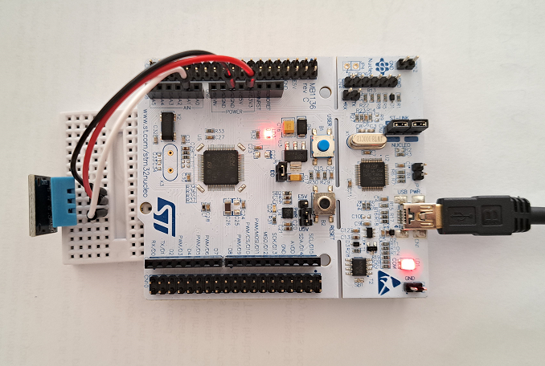
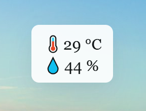

# Full-Stack Sensor Monitoring App

### Introduction

**Full-Stack Sensor Monitoring App** integrates an STM32 board (NUCLEO-F446RE) with a Node.js-based application. It allows users to monitor temperature and humidity data from a DHT11 sensor using a desktop widget.

<table>
  <tr>
    <td></td>
    <td></td>
  </tr>
</table>

This project includes:

- Embedded C firmware for STM32 NUCLEO-F446RE (using HAL and STM32CubeIDE)
- Communication module (C++, Win32 API)
- Node.js native addon (C++)
- Backend server (Typescript, Express.js)
- Electron + React.js frontend

### Architecture

```
DHT11 Sensor --> STM32 board --(Windows)--> Communication Module --> Node.js Addon --> Express backend --> Electron/React frontend
```

### Project Structure

```bash
.
├── firmware/           # Embedded C code for STM32 NUCLEO-F446RE
│   └── dht11/
├── app/
│   ├── backend/        # Express.js server API
│   ├── frontend/       # React + Electron desktop app
│   └── shared/         # Shared types used by both frontend and backend
├── images/             # README images
└── README.md
```

---

### Getting Started

> Prerequisites: STM32 NUCLEO-F446RE board, DHT11 sensor, Windows PC, Node.js (v22+), C++ build tools

#### 1. Flash Firmware

Use STM32CubeIDE to build and flash the firmware located in `/firmware/dht11/` to the NUCLEO-F446RE board.

#### 2. Build and Start Backend Server

```bash
cd app/backend
npm install
npm start
```

Note: This step also builds the Node.js native addon

#### 3. Build an Launch Desktop UI

```bash
cd app/frontend
npm install
npm start
```

### Tech Stack

- STM32 firmware (C, HAL)
- C++, Win32 API
- Node.js + custom addon
- Typescript, Express.js
- React.js, Electron

### License

MIT
